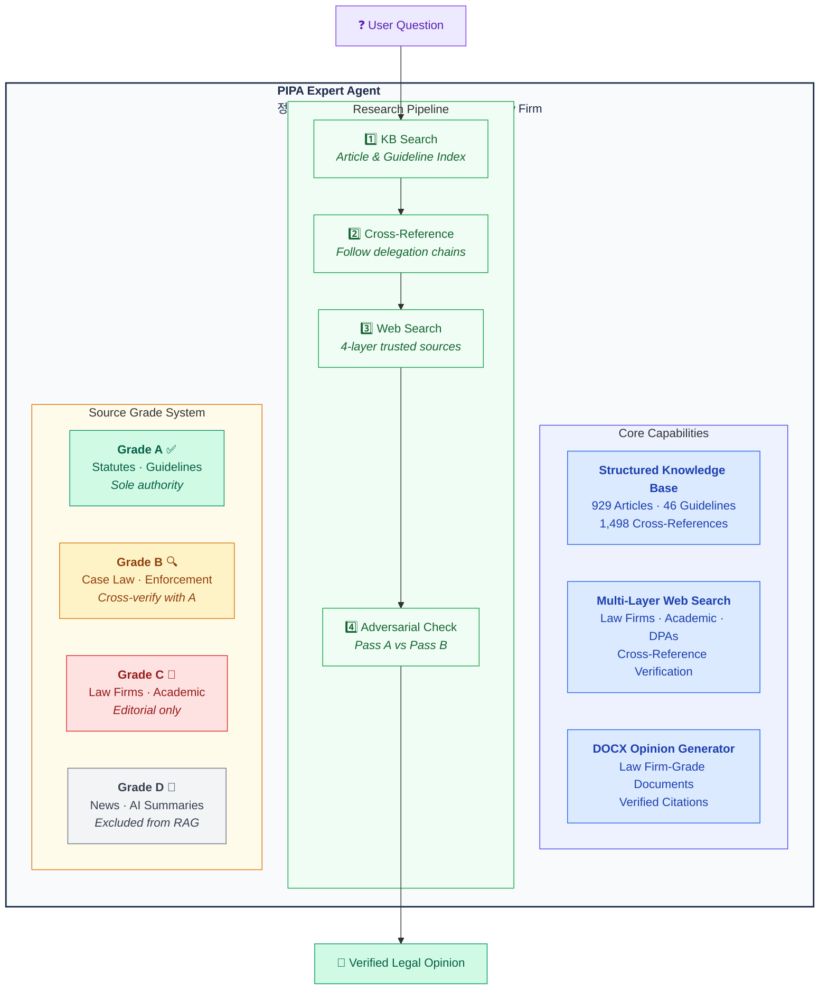
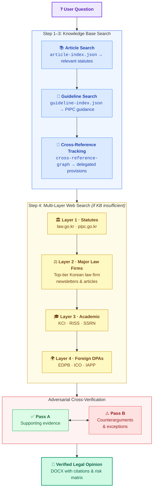

<div align="center">

**[English](#pipa-expert-agent)** · **[한국어](README.ko.md)**

# PIPA Expert Agent

### AI-Powered Korean Data Privacy Law Advisor

**929 statute articles** · **46 official guidelines** · **1,498 cross-references** · **Law firm-grade DOCX opinions**

Built for [Claude Code](https://claude.ai/claude-code) · Powered by structured RAG

[](#-knowledge-base)
[](#-knowledge-base)
[](#-knowledge-base)
[](#-knowledge-base)
[](#license)

<br/>

> *"Data structure is intelligence."*
> — The philosophy behind this project: smarter data beats smarter search.

</div>

> [!CAUTION]
> **This tool is for legal research assistance only — it does not provide legal advice.** Outputs are AI-generated and may contain errors despite built-in verification. All legal citations should be independently verified before reliance. Consult a qualified attorney for advice on specific legal matters. **[Full Disclaimer](docs/en/DISCLAIMER.md)** · **[면책사항](docs/ko/DISCLAIMER.md)**

---

## The Problem

Existing AI legal assistants (ChatGPT Custom GPTs, Gemini Gems, etc.) treat legislation as flat text documents. They upload PDFs, run semantic search, and hope for the best. This approach **fundamentally fails** for legal work because it ignores:

- **Hierarchical structure** — statutes have articles, paragraphs, subparagraphs, and items
- **Cross-references** — Article 15 delegates to Enforcement Decree Article 17
- **Source authority** — a PIPC guideline ≠ a news article ≠ an academic paper
- **Verification** — every citation must be traceable to the exact provision

The result? Hallucinated article numbers, fabricated provisions, and opinions that no lawyer would sign.

---

## The Solution

PIPA Expert takes a different approach: **instead of smarter search, build smarter data.**



---

## Knowledge Base

### Official Legislation — via Open Law API

Every statute is fetched from Korea's [National Law Information Center](https://law.go.kr) Open API, parsed into **individual article-level Markdown files** with YAML frontmatter, and enriched with keyword extraction and cross-reference mapping. Updated monthly.

| Law | Articles | Cross-Refs | Directory |
|-----|----------|------------|-----------|
| **Personal Information Protection Act (PIPA)** | 126 | 190 | `library/grade-a/pipa/` |
| PIPA Enforcement Decree | 140 | 306 | `library/grade-a/pipa-enforcement-decree/` |
| Network Act (정보통신망법) | 142 | 119 | `library/grade-a/network-act/` |
| Network Act Enforcement Decree | 131 | 203 | `library/grade-a/network-act-enforcement-decree/` |
| Network Act Enforcement Rule | 11 | 16 | `library/grade-a/network-act-enforcement-rule/` |
| Credit Information Act (신용정보법) | 91 | 138 | `library/grade-a/credit-info-act/` |
| Credit Information Act Enforcement Decree | 81 | 263 | `library/grade-a/credit-info-act-enforcement-decree/` |
| Location Information Act (위치정보법) | 53 | 73 | `library/grade-a/location-info-act/` |
| Location Information Act Enforcement Decree | 55 | 121 | `library/grade-a/location-info-act-enforcement-decree/` |
| E-Government Act (전자정부법) | 99 | 69 | `library/grade-a/e-government-act/` |
| **Total** | **929** | **1,498** | |

### PIPC Official Guidelines — 46 Documents

All publicly available guidelines from the Personal Information Protection Commission (PIPC), converted from PDF to structured Markdown with frontmatter metadata.

<details>
<summary><b>Full list of 46 guidelines</b></summary>

| # | Title |
|---|-------|
| 01 | Commentary on PIPA (법령해설서) |
| 02 | Integrated Processing Guide (처리 통합 안내서) |
| 03 | Sector-Specific Guide (공공/민간) |
| 04 | Emergency Processing (재난/감염병) |
| 05 | Children & Adolescents Protection |
| 06 | Internet Content Access Exclusion Right |
| 07 | Automated Decision-Making |
| 08 | Safety Standards |
| 09 | Developer Privacy |
| 10 | Biometric Information |
| 11 | Fixed Video Surveillance |
| 12 | Mobile Surveillance |
| 13 | Smart City |
| 14 | Website Exposure Prevention |
| 15 | Synthetic Data Utilization |
| 16 | Pseudonymization Guidelines |
| 17 | Pseudonymization (Public Sector) |
| 18 | Pseudonymization (Education) |
| 19 | Healthcare/Medical Data |
| 20 | Synthetic Data Reference Model |
| 21 | AI Development (Public Data) |
| 22 | AI Privacy Risk Assessment |
| 23 | Generative AI Processing |
| 24 | Privacy Policy Drafting |
| 25 | Privacy Impact Assessment |
| 26 | PIA Cost Estimation |
| 27 | ISMS-P Certification |
| 28 | Privacy Education |
| 29 | Breach Response Manual |
| 30 | Foreign Business PIPA Application (KR + EN) |
| 31 | Liability Insurance |
| 32 | Q&A Compilation |
| 33 | Data Portability |
| 34-36 | Management Agency Designation |
| 37 | General Data Recipient Registration |
| 38 | MyData Transfer Procedures |
| 39a-c | Industry-Specific Guides |
| 40 | Small Business Handbook |
| 41a-c | Standard Privacy Policy Templates |

</details>

### How the Data is Structured

Every article is stored as a standalone `.md` file with rich frontmatter:

```yaml
---
law: "개인정보 보호법"
article: 15
article_title: "개인정보의 수집ㆍ이용"
source_grade: "A"
effective_date: "20251002"
cross_references:
  - "제17조"
  - "제22조"
keywords:
  - "수집"
  - "동의"
  - "정당한 이익"
---

## 제15조(개인정보의 수집ㆍ이용)

① 개인정보처리자는 다음 각 호의 어느 하나에 해당하는 경우에는...
```

This means the AI agent can:
- **Search by keyword** using the index files
- **Follow cross-references** to related articles
- **Verify source authority** via the grade system
- **Read exact provisions** without hallucination

---

## How It Works



Every citation is tagged with its verification status:

| Tag | Meaning |
|-----|---------|
| `[VERIFIED]` | Exact match in Grade A source |
| `[UNVERIFIED]` | Grade B only, or partial match |
| `[INSUFFICIENT]` | Not enough evidence — left blank |
| `[CONTRADICTED]` | Sources conflict — both sides shown |

---

## Fact-Check Layer (Hallucination Prevention)

Before any output is finalized, a **dedicated fact-checker sub-agent** verifies every legal citation against the knowledge base:

| Check | Method | On Fail |
|-------|--------|---------|
| Article exists | Glob for `art{N}.md` in KB | Downgrade to `[UNVERIFIED]` |
| Quoted text matches source | Read file, substring match | Replace with correct text |
| Article number is precise | Frontmatter `article` + `article_title` match | Correct the number |
| Effective date is valid | Compare `effective_date` to today | Add `[미시행]` warning |
| Guideline citation exists | Check `guideline-index.json` | Downgrade or remove |
| Cross-reference is valid | Verify target file exists | Flag broken reference |
| Web source is trusted | Match against trusted domain list | Downgrade Grade |

**Confidence score:** If below 70%, FAIL items are corrected and re-verified before output. Citations affecting core conclusions are withdrawn rather than left unverified.

---

## DOCX Legal Opinion Generator

The agent produces **law firm-grade Word documents** with:

- Professional letterhead (법무법인 진주 / Jinju Law Firm)
- Structured sections: Issues → Analysis → Conclusions → Recommendations
- Risk matrix tables with color coding
- Full citation trail with verification status
- Fact-check report appended
- Signature block and disclaimer
- AI disclosure notice

---

## Source Ingest System

### Adding Your Own Sources

1. Drop any file (PDF, DOCX, etc.) into `library/inbox/`
2. Tell the agent: `/ingest` or "파일 넣었어"
3. The agent will automatically:

```
library/inbox/    ← drop files here
     │
     ▼ /ingest or "파일 넣었어"
     │
     ├─ Auto-convert to Markdown (via MarkItDown)
     ├─ Auto-classify Grade (A/B/C based on content signals)
     ├─ Auto-generate frontmatter (keywords, citations, metadata)
     ├─ Place in library/grade-{a,b,c}/
     └─ Update search indexes
```

> **Note:** Dropping files alone does not trigger processing. You must run `/ingest` or tell the agent (e.g. "inbox에 파일 넣었어") to start the parsing pipeline.

---

## Project Structure

```
PIPA-expert/
├── library/
│   ├── inbox/                    # Drop zone for new sources
│   ├── grade-a/                  # Authoritative sources
│   │   ├── pipa/                 #   PIPA articles (126)
│   │   ├── pipa-enforcement-decree/  #   Enforcement Decree (140)
│   │   ├── network-act/          #   Network Act (142)
│   │   ├── pipc-guidelines/      #   Official guidelines (46)
│   │   └── ...                   #   + 6 more statute sets
│   ├── grade-b/                  # Case law, enforcement decisions
│   └── grade-c/                  # Law firm analysis, academic papers
├── index/
│   ├── article-index.json        # Searchable article index (929 entries)
│   ├── guideline-index.json      # Guideline index (46 entries)
│   └── source-registry.json      # Collection status dashboard
├── config/
│   ├── source-grades.json        # A/B/C/D grade definitions
│   └── rag-config.json           # Search configuration
├── scripts/
│   ├── fetch-pipa-from-api.py    # Open Law API collector
│   ├── preprocess-guidelines.py  # PDF → Markdown pipeline
│   └── build-guideline-index.py  # Index generator
├── .claude/
│   ├── agents/pipa-agent.md      # Agent definition
│   └── skills/
│       ├── legal-opinion-formatter/  # DOCX generation skill
│       └── ingest/               # Source ingestion skill
├── output/opinions/              # Generated DOCX opinions
└── docs/                         # Design specs
```

---

## Getting Started

> **New here?** Read the **[How to Use Guide](docs/en/HOW-TO-USE.md)** — a step-by-step walkthrough for non-developers.

### Prerequisites

- [Claude Code](https://claude.ai/claude-code) CLI
- Python 3.10+
- `python-docx` (`pip install python-docx`)

### Setup

```bash
git clone https://github.com/kipeum86/PIPA-expert.git
cd PIPA-expert
pip install python-docx
```

### Refresh Law Data (Monthly)

```bash
python3 scripts/fetch-pipa-from-api.py --oc YOUR_EMAIL_ID
```

Requires a free [Open Law API](https://open.law.go.kr) account. The `--oc` parameter is your registered email ID.

### Run the Agent

```bash
cd PIPA-expert
claude   # launches Claude Code in this directory
```

Then use `/agents/pipa-agent` to activate the PIPA expert persona.

### Example Queries

```
"개인정보보호법 제15조 보여줘"
"맞춤형 광고 동의 구조 재설계 방안 의견서 작성해줘"
"정보통신망법과 개인정보보호법의 동의 규정 차이점"
"제3자 제공 관련 법률의견서 DOCX로 만들어줘"
```

---

## Part of Jinju Law Firm

PIPA Expert is one of several specialized legal AI agents operating under the fictional **법무법인 진주 (Jinju Law Firm)**:

| Agent | Attorney | Specialty |
|-------|----------|-----------|
| [game-legal-research](https://github.com/kipeum86/game-legal-research) | 심진주 (Sim Jinju) | Game industry law |
| [legal-translation-agent](https://github.com/kipeum86/legal-translation-agent) | 변혁기 (Byeon Hyeok-gi) | Legal translation |
| [general-legal-research](https://github.com/kipeum86/general-legal-research) | 김재식 (Kim Jaesik) | Legal research |
| **PIPA-expert** | **정보호 (Jeong Bo-ho)** | **Data privacy law** |
| [contract-review-agent](https://github.com/kipeum86/contract-review-agent) | 고덕수 (Ko Duksoo) | Contract review |
| [legal-writing-agent](https://github.com/kipeum86/legal-writing-agent) | 한석봉 (Han Seokbong) | Legal writing |
| [second-review-agent](https://github.com/kipeum86/second-review-agent) | 반성문 (Ban Seong-mun) | Quality review (Partner) |

---

## License

MIT

---

<div align="center">
<sub>Built with structured data, not blind faith in embeddings.</sub>
</div>
